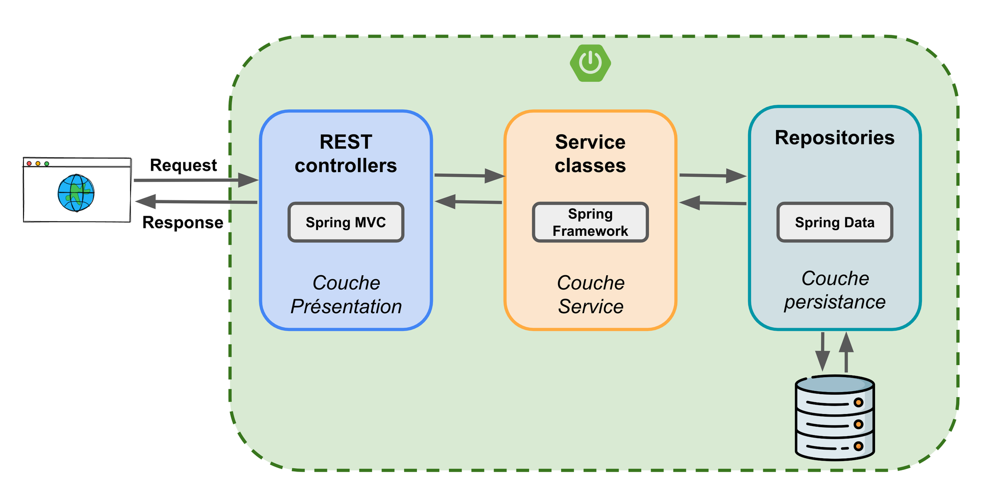

# Architecture de l'application REST

L’architecture REST de l’application Leasa repose sur une organisation en **trois couches principales**, représentées dans le schéma ci-dessous :

## Présentation des couches

### 1. Couche Présentation (`Service`)

Cette couche est constituée des **contrôleurs REST**, exposés grâce à **Framework Spring**. Elle gère les requêtes en provenance du frontend.

Rôle principal :
- Récupérer les données du frontend (généralement au format DTO),
- Appeler les services métier adéquats,
- Retourner une réponse HTTP formatée.

### 2. Couche Service (`Processus`)

Il s’agit de la **couche métier**, appelée **processus** dans notre projet.

Chaque interface de service définit les opérations disponibles (ex: `DemandeProcessus`, `FactureProcessus`) et est implémentée dans une classe suffixée par `Impl`.

Caractéristiques :
- Elle contient la logique métier propre à chaque fonctionnalité.
- Elle est annotée avec `@Transactional`, ce qui garantit que les opérations s’exécutent dans le contexte d’une transaction gérée par **Hibernate**.

### 3. Couche Persistance (`DAO`)

Cette couche correspond aux DAO (Data Access Object) classiques. Elle repose sur **Spring Data JPA**.

Fonction :
- Communiquer avec la base de données via des entités JPA.
- Fournir des méthodes de requête prêtes à l’emploi ou personnalisées avec QueryDSL ou des `@Query`.

---

## Enchaînement classique des appels

Lorsqu’un utilisateur effectue une recherche ou une action via l’interface web :

1. Le **controller REST** reçoit la requête (avec éventuellement un DTO en entrée).
2. Il appelle le **service métier** (processus) correspondant.
3. Ce service :
   - Effectue les traitements nécessaires,
   - Appelle un ou plusieurs **repositories** pour interroger ou modifier la base de données.
4. Une fois la donnée traitée, elle est renvoyée au **controller**, puis transmise au frontend sous forme de JSON.

---

## Mapping DTO ↔ Entity

Le **controller** ou le **service** se charge de **mapper** ces DTO en entités JPA lorsqu’une opération sur la base est nécessaire, ou l’inverse lorsqu’on retourne un résultat à afficher.

---