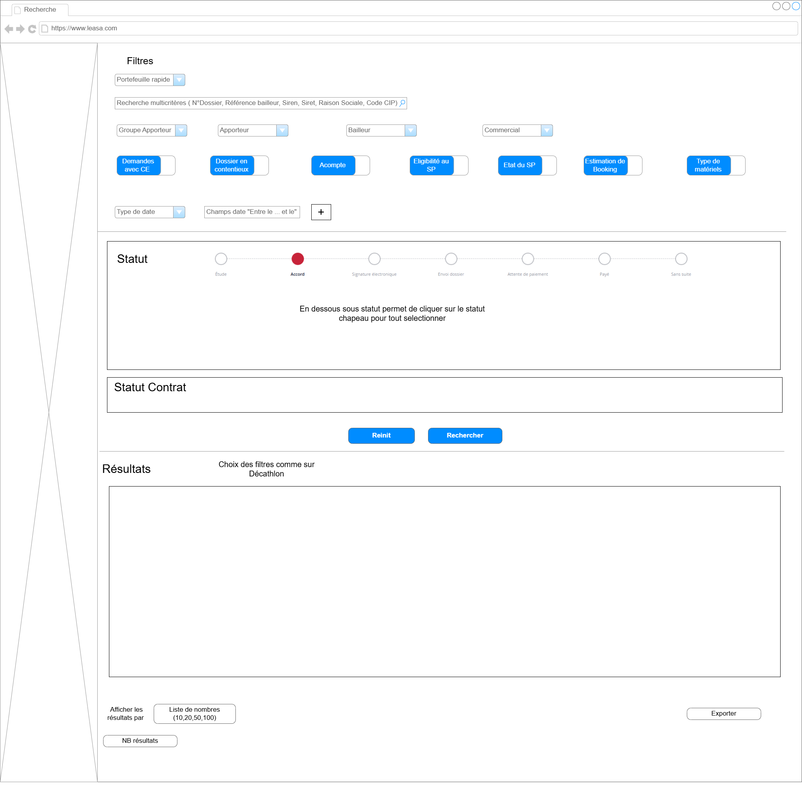
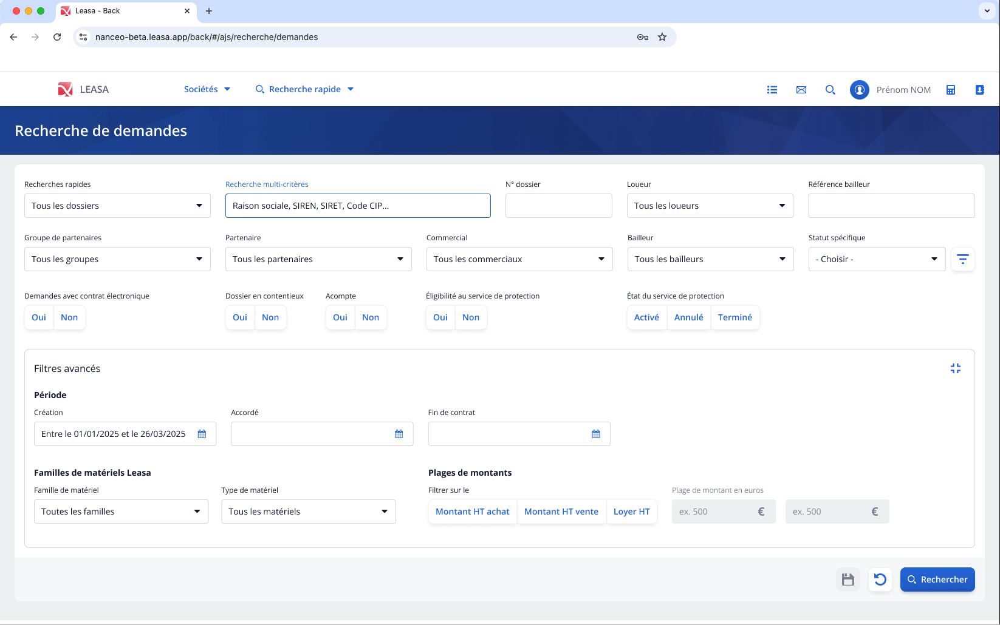
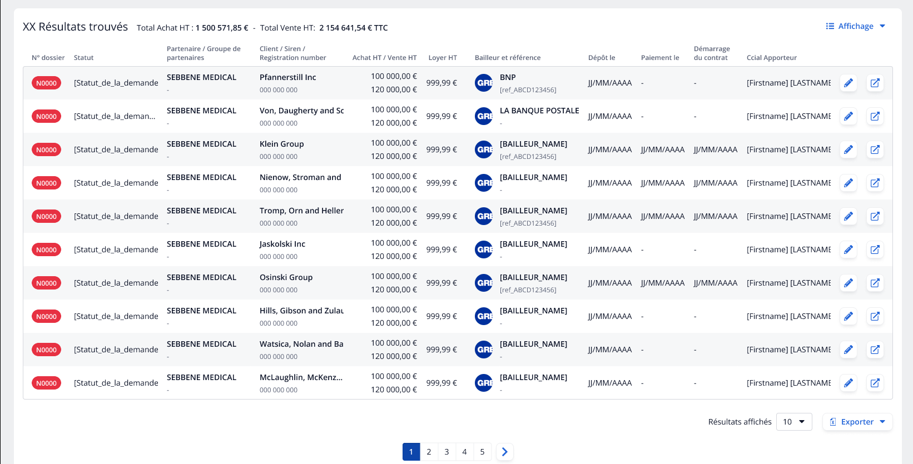

# Maquette et Wireframes recherche de demandes

Avant le développement de l’écran, j’ai réalisé des **[wireframes](../glossaire/Vocab.md#wireframe** sur Draw.io afin de structurer l’interface et le parcours utilisateur.  
Ces wireframes ont servi de **base fonctionnelle** pour valider l’emplacement des filtres, l’organisation des résultats et le parcours logique de la recherche, avant la réalisation des maquettes par Nicolas, le graphiste.

L’objectif de ces maquettes était de **visualiser le futur écran de recherche** avant son développement, en s’appuyant sur les besoins utilisateurs et les wireframes validés.

## Wireframes (Draw.io)

## Maquettes

L’objectif de ces maquettes était de **visualiser le futur écran de recherche** en appliquant la charte graphique et les composants.  
Elles reprennent la structure définie dans les wireframes et permettent de valider l’apparence auprès des utilisateurs avant développement.

### Partie Filtres

### Partie Résultats

