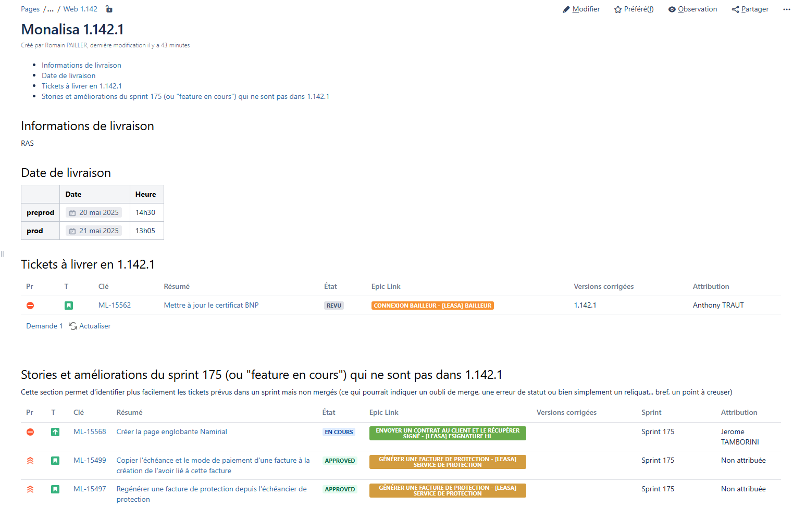
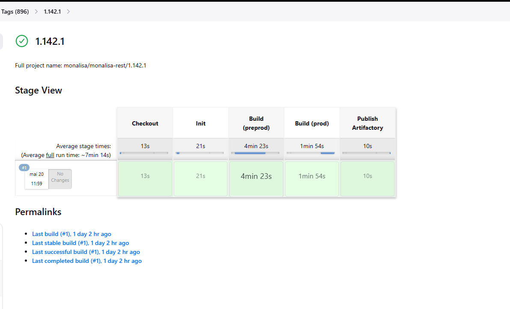
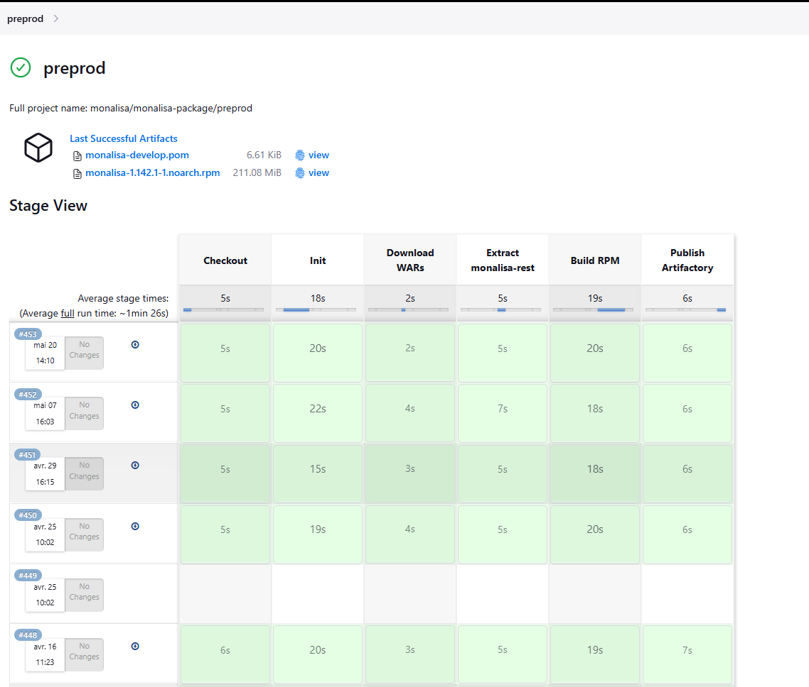
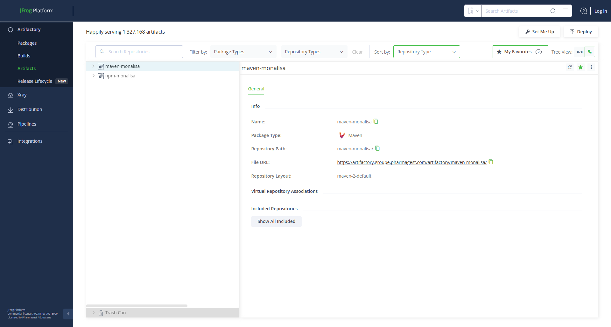
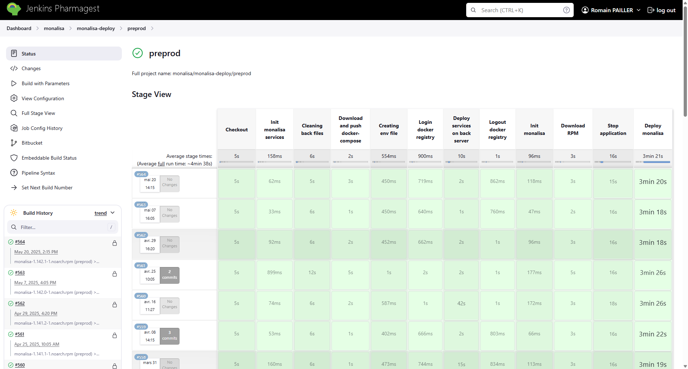

# Déploiement de la version 1.142.1 en environnement de préproduction

## Contexte

Dans le cadre de l’évolution de l’application Monalisa, une nouvelle version (1.142.1) devait être déployée sur l’environnement de **préproduction** afin de permettre les phases de validation et de test utilisateurs avant une mise en production.

Mon rôle a été d’assurer l’ensemble du processus de **déploiement applicatif**, depuis la validation des tags jusqu’à l’installation du RPM sur les serveurs de préproduction.

## Étapes réalisées

### 1. Vérification préalable

Avant de procéder au déploiement, j’ai attendu la finalisation de la merge request d’un autre développeur. Une fois cette action effectuée, j’ai pu lancer les étapes de tagging et de packaging.

J’ai également créé la page de version correspondante sur Confluence pour identifier les tickets concernés :

### 2. Création des tags

J’ai ensuite créé manuellement les **tags Git** pour les différents modules de Monalisa. Chaque tag déclenche automatiquement un **build Jenkins**, qui génère les artefacts nécessaires à la suite du processus.

J’ai veillé à ce que les **builds soient tous marqués comme réussis**, condition indispensable à la suite du processus.

### 3. Packaging

Une fois les tags validés, j’ai lancé le job Jenkins suivant pour packager l’application :

Ce job permet de générer un **RPM** à partir des artefacts Maven. Il est ensuite déposé automatiquement dans **Artifactory**, dans le référentiel suivant :

Une vérification dans la liste déroulante des versions disponibles m’a permis de m’assurer que le RPM avait bien été généré.

### 4. Déploiement

La dernière étape consiste à déployer le RPM sur l’environnement de préproduction, à l’aide d’un second job Jenkins :

Depuis l’interface de build avec paramètres, j’ai sélectionné :

- Le **RPM** à déployer (récupéré depuis Artifactory),
- Le **serveur cible** correspondant à la préproduction.

Une fois le job lancé, Jenkins installe le RPM sur le serveur désigné. Un message d’erreur peut s’afficher à la fin du script d’installation : dans ce cas, il est conseillé d’attendre quelques secondes avant de tester l’accessibilité de l’application.

### 5. Vérifications post-déploiement

Enfin, j’ai vérifié que :

- Le back office et le front office étaient bien accessibles sur l’environnement préproduction
- La version correspondait bien à la 1.142.1,
- Aucun microservice déployé ne présentait d’anomalie apparente.

