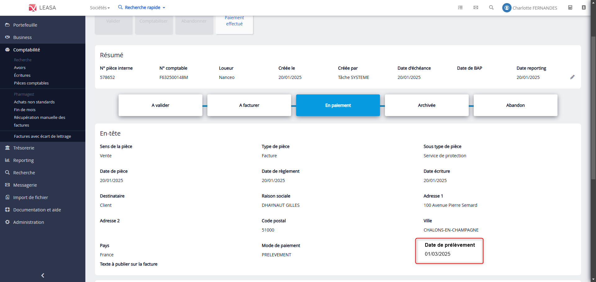

# Ajout de la date de prélèvement

## Contexte

Les **pièces comptables** créées dans Leasa peuvent être réglées selon différents modes de paiement, notamment par **prélèvement automatique**. Jusqu’à présent, la **date estimée de prélèvement** n’était affichée que sur le document PDF de la pièce. Concrètement, cela obligeait les utilisateurs à télécharger chaque document pour obtenir cette information.

## Ticket


## Objectif de l'amélioration

Afin de faciliter l'accès à l'information, la date de prélèvement est désormais **affichée directement dans l'interface** de consultation de la [pièce comptable](../../glossaire/Vocab_metier.md#pièce-comptable) **uniquement si le mode de paiement est "Prélèvement"**.

## Modification apportée

### Backend

J’ai ajouté le champ `datePrelevementEstimee` dans la [projection](../../glossaire/Vocab.md#projection) `FactureProjectionDetailsImpl` afin que cette donnée soit transmise au frontend lors de la consultation de la pièce.

```java
Q_FACTURE.datePrelevementEstimee,
```

### Frontend

- Dans le [contrôleur](../../glossaire/Vocab.md#controller) `PieceComptableController`, ajout d’un indicateur `isPrelevement`, activé uniquement si la pièce a pour mode de paiement **"Prélèvement"**.

```js
$scope.isPrelevement =
        $scope.facture.modePaiement === FactureService.CONSTANTES_FACTURES.MODE_PAIEMENT.PRELEVEMENT;
```

- Dans la [vue](../../glossaire/Vocab.md#vue) `detailsFactureViewMode.html`, un bloc conditionnel affiche la **date de prélèvement estimée** si ce critère est respecté.

```html
<div class="col-md-4" ng-if="isPrelevement">
  <p><strong>{{"SYNTHESE_FACTURE.DATE_PRELEVEMENT" | translate}}</strong></p>
  <p ng-bind="(facture.datePrelevementEstimee | date:'shortDate')"></p>
</div>
````

### Résultat



### Conclusion

Cette fonctionnalité, bien que rapide à développer, a été une bonne opportunité pour **me remettre dans le rythme du projet**.
Elle m’a permis de retravailler à la fois sur la partie backend (ajout de nouvelles données dans la projection) et sur la partie frontend (affichage conditionnel et adaptation de la vue), tout en livrant une amélioration concrète et immédiatement utile aux utilisateurs.