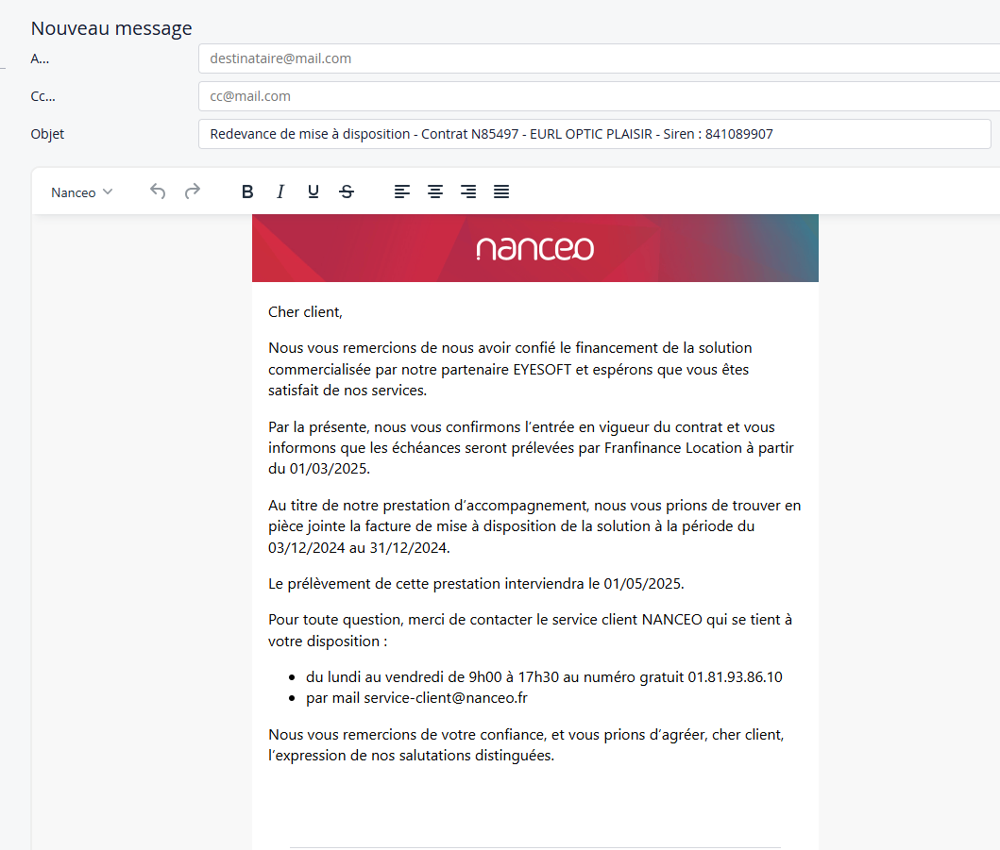
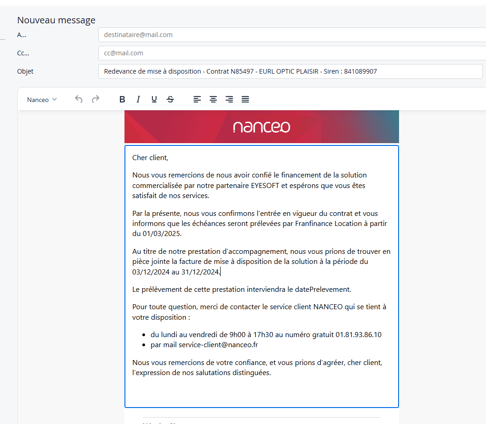
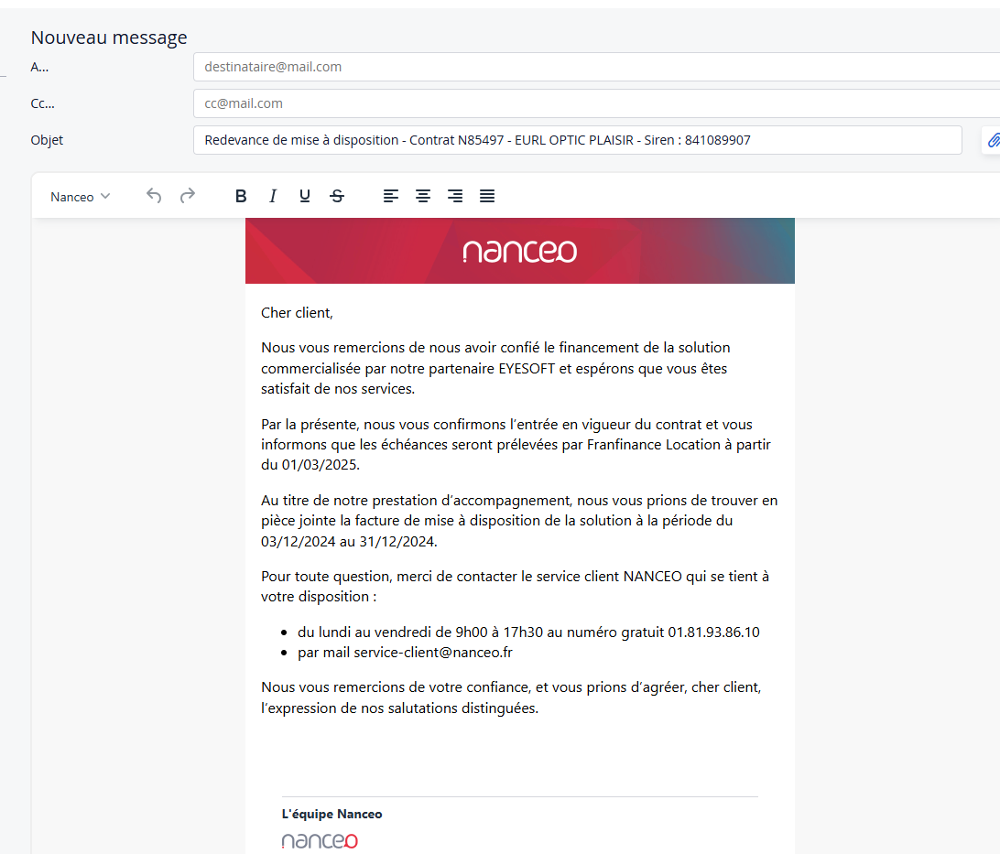

# Template de mail pour la lettre de bienvenue

## Contexte

Depuis l’application, il est possible d’envoyer un email de bienvenue après la facturation d’un dossier.
Ce mail repose sur un template [Mustache](./../../Annexes/Presentation-projets/mustache.md), qui nécessite différentes données comme des dates ou des numéros de contrat. Avant de commencer, j’ai échangé avec Charlotte pour clarifier la structure du template et les données à lui fournir.

## Ticket

## Objectif

Mon objectif était d’améliorer l’existant. Le template de mail existait déjà, mais comportait plusieurs fautes d’orthographe et surtout, il manquait certaines données que les commerciaux devaient compléter manuellement.

J’ai donc ajouté :

- Le code de la demande
- La [raison sociale](../../glossaire/Vocab_metier.md#raison-sociale) du client
- Le [siren](../../glossaire/Vocab_metier.md#siren) du client
- Les dates du [Loyer Intercalaire](../../glossaire/Vocab_metier.md#loyer-intercalaire)
- La date de prelevement estimée

## Réalisations

La partie la plus technique a été de gérer l’affichage conditionnel de la date de prélèvement estimée.
En effet, cette date ne devait apparaître que si une seule facture était comptabilisée, et si son type était "loyer facture vente".
Il fallait aussi exclure les factures annulées par un avoir.
Pour répondre à ce besoin, j’ai créé un nouveau processus au sein de l’[architecture REST](./../../Annexes/Presentation-projets/Architecture.md)

## Ce que j'ai appris

Ce développement m’a permis de consolider mes compétences sur :

- La gestion conditionnelle de données côté backend
- L’intégration de données métiers dans un template Mustache
- Ma compréhension du fonctionnement métier des demandes dans Leasa, notamment sur la manière dont les données sont liées entre les demandes et les factures

## Le code

:::info
Le code source se trouve [ici](../../annexes/bout_de_code/FEAT/codeSource_LettreBienvenue.md)
:::

### DemandeFactureProcessusImpl.java

Dans cette classe, j’ai ajouté une nouvelle méthode métier `getFacturesFiltreesLoyerSansAvoir` avec pour objectif clair : filtrer les factures d’une demande pour ne conserver **que celles qui sont réellement prises en compte dans le calcul de la date de prélèvement estimée**. 

Concrètement, j’ai commencé par récupérer uniquement les factures **comptabilisées** dans le système comptable [**Monalisa-Compta**](./../../Annexes/Presentation-projets/compta.md).  
Ensuite, j’ai exclu toutes celles ayant un **[avoir](../../glossaire/Vocab_metier.md#avoir)** associé, car elles ne doivent pas être considérées dans le calcul.  
Enfin, j’ai appliqué un dernier filtre pour ne garder que les factures dont le sous-type correspond à **LOYER_FACTURE_VENTE**.
Cette méthode est utilisée dans le `MailBuilder` pour alimenter automatiquement le template de la lettre de bienvenue avec la bonne date, uniquement lorsque les conditions sont réunies.

### Le mailBuilder

Pour compléter cette fonctionnalité, j’ai travaillé sur la génération du mail de bienvenue, envoyé au client lors de la mise en place de son contrat.

J’ai implémenté la méthode `getTemplateLettreBienvenue`, qui commence par charger toutes les données nécessaires depuis la demande (`Demande`) via les processus métiers.  Elles sont ensuite stockées dans un [contexte](../../glossaire/Vocab.md#contexte) sous forme de [Map](../../glossaire/Vocab.md#map) (String, Object) qui sera utilisé par les templates [Mustache](./../../annexes/Presentation-projets/mustache).

Parmi les données injectées dans le template, on retrouve :  

- Les coordonnées du bailleur, de l’apporteur et du client
- La date de démarrage du contrat  
- Les coordonnées du [loueur](../../glossaire/Vocab_metier.md#loueur) (téléphone, email)  
- Le code de la demande  

J’utilise ensuite `getFacturesFiltreesLoyerSansAvoir` pour déterminer la date de prélèvement estimée, uniquement si une facture éligible est trouvée.  
Si un loyer intercalaire existe, j’ajoute également les dates de début et de fin de cette période.

Enfin, la signature est configurée selon les règles internes et l’ensemble des données est injecté dans les templates Mustache pour générer le sujet, le corps et la signature du mail, en adaptant le contenu selon la présence ou non d’une date de prélèvement.

### Résultats

Le cas où une facture est de sous-type facture vente avec un mode de paiement 'PRELEVEMENT' comptabilisée

Le cas où deux facture ou plus sont de sous-type Facture Vente avec un mode de paiement 'PRELEVEMENT' comptabilisée

Le cas où aucune facture n'est de sous-type Loyer Facture Vente avec un mode de paiement 'PRELEVEMENT' comptabilisée

### Conclusion

Ce développement m’a permis de découvrir un domaine que je n’avais encore jamais abordé : la création de **templates de mails**.  
J’ai pu constater à quel point cet outil peut être utile pour nos utilisateurs finaux, qui doivent régulièrement communiquer avec leurs clients par email.  
En automatisant et en structurant ce type de messages, on leur fait gagner du temps tout en garantissant une présentation professionnelle et cohérente.

---
