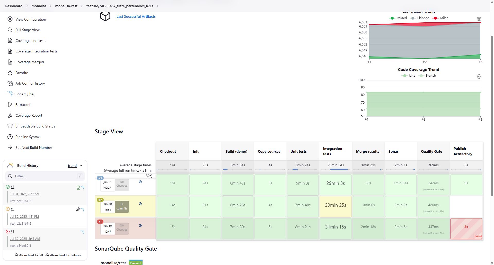

# Déroulement d’une nouvelle fonctionnalité

La mise en place d’une nouvelle fonctionnalité suit un processus itératif, structuré autour des **sprints** définis par l’équipe.

# 1. **Collecte des besoins**
   Tout commence par la **collecte du besoin** auprès des utilisateurs finaux (par exemple les commerciaux ou l’ADV back-office).  
Cette étape se déroule au travers de **réunions** réunissant :

   - Les **utilisateurs métier**,
   - L’**analyste fonctionnelle** (Charlotte),
   - Le **Product Owner (PO)**.

   L’objectif est de comprendre le contexte, d’identifier les attentes précises et de formaliser les **cas d’usage**.  
   Ces besoins peuvent être synthétisés dans un **cahier des charges** ou un document fonctionnel de référence.

# 2. **Conception fonctionnelle et préparation**  
   Une fois les besoins validés, on passe à la **formulation en spécifications** :

   - **Création de maquettes** ou wireframes pour visualiser la future interface,
   - **Rédaction d’un ticket Jira** par l’analyste fonctionnelle (Charlotte),
   - Ajout éventuel de pièces jointes (captures, schémas, maquettes, règles métier).   

   À ce stade, le ticket est placé dans le **bac de départ** (backlog), en attente de planification.  
   Ce n’est qu’une fois priorisé qu’il intègre le **bac du sprint**.

# 3. **Prise en charge par un développeur**  
   Lors de la réunion de planification de sprint, les tickets sont répartis entre les développeurs. Celui ou celle chargé(e) d’un ticket commence par en analyser le contenu pour :

   * Comprendre le besoin exprimé,  
   * Identifier les impacts sur les entités métier et les couches techniques (REST, services, base de données),  
   * Lister les fichiers susceptibles d’être modifiés ou créés.

# 4. **Développement technique**  
   La phase de développement consiste à implémenter la solution répondant au besoin. Au besoin, il peut échanger avec Charlotte ou bien avec d'autres développeurs à ce sujet. Le **daily meeting** est fait pour exprimer les difficultés rencontrées afin de faciliter l'apport d'aide d'autres collègues.

# 5. **Tests et validation**  
   Une fois le code produit :

   * Des **tests unitaires** ou d’**intégration** sont ajoutés,  
   * Une **pull request** est créée,  
   * Une validation des pairs est nécessaire  
   * Un build Jenkins se lance et vérifie plusieurs choses (le build, les tests, le coverage des tests, l'indentation, la traduction, etc...),  
   * La personne chargée des **releases** intègre la nouvelle fonctionnalité dans une version,
   * Puis le ticket est envoyé à Julien, analyste testeur, qui valide la fonctionnalité sur l’environnement de test (souvent en béta).

## Un exemple de build Jenkins

# 6. Nos environnements de test

Pour fiabiliser les mises en production, nous disposons de plusieurs environnements :

- **Beta** : environnement stable où l’analyste testeur et l’équipe métier valident les nouvelles fonctionnalités.
- **Pré-production (preprod)** : copie quasi-identique de la production, utilisée pour les derniers tests avant mise en ligne.
- **Production (prod)** : version utilisée par les clients finaux.

---
