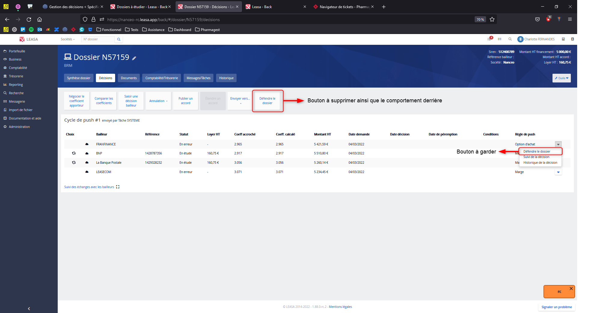

# Suppression du bouton « Défendre le dossier » dans l’onglet Décision

## Contexte

Dans l’onglet **Décision** d’une demande, deux boutons permettaient de lancer l’action **« Défendre le dossier »** :  

- l’un dans le menu principal,  
- l’autre directement sur chaque ligne de décision dans les cycles de push.

Ce doublon créait de la confusion pour les utilisateurs. Le bouton dans le menu principal utilisait une ancienne mécanique d’envoi de mail, via une **page dédiée et une modale** qui ne sont plus du tout utilisées.  
À l’inverse, le bouton sur la ligne est plus moderne : il ouvre le **panneau latéral prérempli** avec toutes les infos utiles issues de la décision.

## Besoin

La présence de ces deux boutons provoquait pas mal d’incohérences :

- Le bouton du menu ne tenait pas compte du contexte réel (pas de ligne sélectionnée),
- Il déclenchait l’ouverture d’une ancienne page et utilisait un **template d’email obsolète**,
- Et surtout, il ne respectait plus le **parcours utilisateur** défini dans le cadre du nouveau processus de relance côté métier.

## Solution apportée

Charlotte à donc décidé de **supprimer le bouton « Défendre le dossier » du menu principal**, pour ne garder que celui sur les lignes de décision.

On en a aussi profité pour faire un peu de ménage dans le code :

- J’ai retiré la route vers l’ancienne page d’envoi de mail,
- Supprimé complètement la **modale d’email** qui n’était plus utilisée,
- Supprimé le **template** dédié à cette ancienne logique,
- Nettoyé le code du composant et de son contrôleur,
- Mis à jour les **tests unitaires** pour refléter ces changements.

## Fichiers modifiés

- `routing.js` → suppression de la route obsolète
- Composant bouton → retrait du bouton + logique associée
- Template HTML → nettoyage de l’affichage conditionnel
- Backend → désactivation de l’appel au vieux template d’email
- Tests → suppression des cas liés à cette fonctionnalité supprimée

## Résultat

Aujourd’hui, il ne reste qu’un **seul bouton clair, accessible depuis chaque ligne de décision**, qui respecte le contexte métier, les nouvelles pratiques, et qui ouvre le panneau de messagerie latéral avec toutes les données bien remplies.  
C’est plus propre, plus cohérent, et ça évite toute erreur d’usage côté utilisateur.

---
