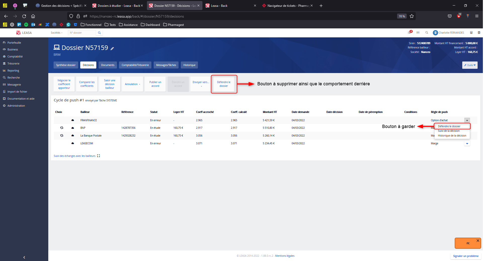

# Suppression du bouton « Défendre le dossier » dans le menu principal de l’onglet « Décision »

## Contexte

Dans l’onglet **Décision** d’une demande, l’utilisateur disposait jusqu’à présent de deux boutons **« Défendre le dossier »** : l’un dans le menu principal de l’onglet, l’autre sur chaque ligne de décision lors du cycle de push. Cette redondance ne correspond pas au processus métier attendu et peut induire une confusion dans le parcours utilisateur.

## Bug

La coexistence de ces deux boutons entraînait un parcours utilisateur incohérent : le bouton du menu principal ne respectait pas le même contexte que celui de la ligne de décision et ne préremplissait pas le template d’email de défense de dossier. De plus, il ouvrait une page dédiée et une modale d’envoi d’email désormais obsolètes, ce qui ajoutait de la dette technique et compliquait la maintenance.

## Correction

J'ai retiré le bouton **« Défendre le dossier »** du menu principal de l’onglet **Décision** et supprimé toutes les ressources associées : la page dédiée, la modale d’envoi d’email ainsi que le template de défense de dossier. Seul le bouton situé sur chaque ligne de décision a été conservé. Après ces modifications, nous avons vérifié que ce bouton restait pleinement fonctionnel : il ouvre toujours le panneau latéral d’email et préremplit correctement le template de défense de dossier.
