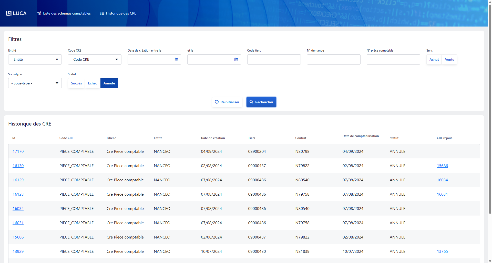

# Ajout du statut "Annulé" dans le filtre de l’historique des CRE

## Contexte

L’application **[Monalisa-Compta](../../../annexes/compta)**, interfacée avec le projet **Leasa**, permet d’interpréter des [CRE](../../../glossaire/Vocab_metier.md#cre) (Compte Rendu d'Événement) pour générer des [écritures comptables](./../../../glossaire/Vocab_metier.md#ecriture-comptables). Dans l’écran de consultation de l’historique des CRE, un système de filtres permet de cibler les événements selon plusieurs critères, dont leur statut (**Succès** ou **Échec**). Toutefois, certains CRE peuvent également être annulés, notamment dans des cas de traitement invalidé ou abandonné côté équipe commerciale. Jusqu’ici, cette valeur n’était pas intégrée au filtre, ce qui empêchait de les consulter facilement.

## Ticket


## Besoin

L’absence de la valeur **Annulé** dans le filtre *Statut* limitait la visibilité sur l’ensemble des CRE traités. Bien que ces événements soient stockés et marqués correctement dans la base de données, ils n’étaient pas accessibles via l’interface utilisateur, ce qui compliquait leur suivi, notamment lors d’analyses ou de vérifications comptables.

## Correction

Pour résoudre ce problème, j’ai ajouté la valeur **Annulé** au filtre de statut, afin de permettre aux utilisateurs de retrouver tous les CRE, quel que soit leur état.  
Cette modification a impliqué des ajustements sur plusieurs couches :  

:::info
Le code source complet se trouve [ici](./../../../Annexes/bout_de_code/FIX/ML-14620.md)
:::

- **Backend** : modification du modèle de critères de recherche pour que le champ `statut` accepte désormais trois valeurs (`SUCCES`, `ECHEC`, `ANNULE`), et adaptation du service de traitement pour prendre en charge ce nouveau type.  
- **Frontend** : ajout d’un bouton supplémentaire dans le composant de filtre pour permettre à l’utilisateur de sélectionner le statut *Annulé*.  
- **OpenAPI** : mise à jour de la spécification `historiquecriteria.yaml` afin de refléter cette nouvelle valeur dans la documentation et dans les contrôles de validation.



### Backend

- **Modèle de critère de recherche**  
  Le champ `statut` dans `CompteRenduEvenementCriteria.java` est passé de `Boolean` à un type énuméré `Statut`, afin d’accepter trois valeurs explicites : `SUCCES`, `ECHEC`, `ANNULE`.

- **Service de traitement**  
  Le prédicat conditionnel dans le service `CompteRenduEvenementServiceImpl` a été modifié comme suit :

  ```java
  // Ancienne version
  Predicate statutPredicate = cb.equal(root.get("statut"),
      compteRenduEvenementCriteria.getStatut() ? Statut.SUCCES : Statut.ECHEC);

  // Nouvelle version
  Predicate statutPredicate = cb.equal(root.get("statut"),
      compteRenduEvenementCriteria.getStatut());
    ```

### Frontend

- HTML du composant de filtre

    Un bouton supplémentaire a été ajouté au composant ml-ui-button-radio dans l’écran de l’historique des CRE, permettant à l’utilisateur de filtrer les CRE annulés :

```html
    <ml-ui-button-radio formControlName="statut" [nullable]="true">
        <button type="button" mlUiButton [mlUiButtonValue]="'SUCCES'">Succès</button>
        <button type="button" mlUiButton [mlUiButtonValue]="'ECHEC'">Échec</button>
        <button type="button" mlUiButton [mlUiButtonValue]="'ANNULE'">Annulé</button>
    </ml-ui-button-radio>
```

### OpenAPI

- Fichier historiquecriteria.yaml
Le champ statut a été redéfini dans le schéma comme suit pour refléter les nouvelles valeurs autorisées :

````yaml
statut:
  type: string
  enum:
    - SUCCES
    - ECHEC
    - ANNULE
  description: Statut du CRE à filtrer
````

## Conclusion

Cette intervention m’a permis de travailler pour la première fois sur le **[microservice](../../../glossaire/Vocab.md#microservice) Monalisa-Compta**.  
J’ai ainsi mieux compris son rôle dans la gestion des CRE et la manière dont il s’interface avec Leasa.  
Ce correctif, même simple en apparence, m’a donné une bonne vision de la chaîne complète — du backend jusqu’à l’interface utilisateur sur un autre projet que le back-office.

---
