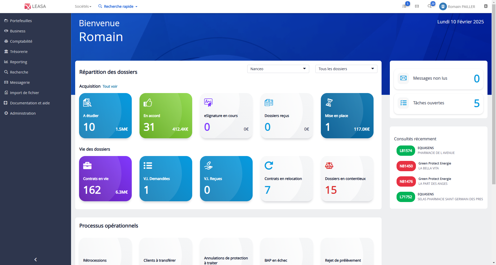

# Recalcul de la tuile "Contrats en relocation" sur la page d’accueil

## Contexte

Sur la page d’accueil de l’application Leasa, un ensemble de **tuiles informatives** permet de visualiser rapidement l’état d’avancement des différents dossiers : contrats en vie, dossiers à étudier, mises en place, etc. Parmi celles-ci, la tuile **"Contrats en relocation"** affiche le nombre de dossiers en cours de traitement dans le cadre d’une relocation.

La relocation correspond à un processus par lequel un contrat de location est interrompu de manière anticipée et doit être remplacé par un nouveau financement. Elle intervient en général à l’initiative du client ou du fournisseur, dans le cadre d’un renouvellement, d’un changement de matériel ou d’un réaménagement de contrat.

## Problème

Avant la correction, la tuile **"Contrats en relocation"** affichait un total qui incluait **toutes les tâches de type relocation**, qu'elles soient **ouvertes ou fermées**. Ce comportement ne reflétait pas l’état opérationnel réel et pouvait induire l’utilisateur en erreur sur les dossiers effectivement en cours de traitement.

## Correction

Pour obtenir une donnée plus pertinente, la logique de calcul a été revue afin de **ne compter que les dossiers possédant une tâche "Relocation" actuellement ouverte**.

### Ajustements apportés

- **Filtrage renforcé sur l’état des tâches** :  
  Seules les tâches ouvertes (c’est-à-dire non clôturées) sont désormais prises en compte dans le calcul.

- **Non-duplication des dossiers** :  
  Si plusieurs tâches ouvertes de type relocation existent pour un même dossier, ce dernier **n’est comptabilisé qu’une seule fois**.

- **Critère ajouté dans le modèle de recherche** :  
  Le champ `tacheOuverte` a été ajouté à l’objet `StatistiqueDemandeCriteria` pour permettre un filtrage explicite des tâches selon leur état.

- **Comportement aligné avec les filtres du bloc "Répartition des dossiers"** :  
  Le calcul tient désormais compte des filtres globaux définis sur la page (portefeuille, société, etc.), assurant ainsi une cohérence entre les tuiles et les données visibles ailleurs dans l’application.

Grâce à cette amélioration, la tuile "Contrats en relocation" reflète désormais de façon fiable les dossiers réellement en cours de traitement, facilitant le suivi opérationnel par les gestionnaires.
