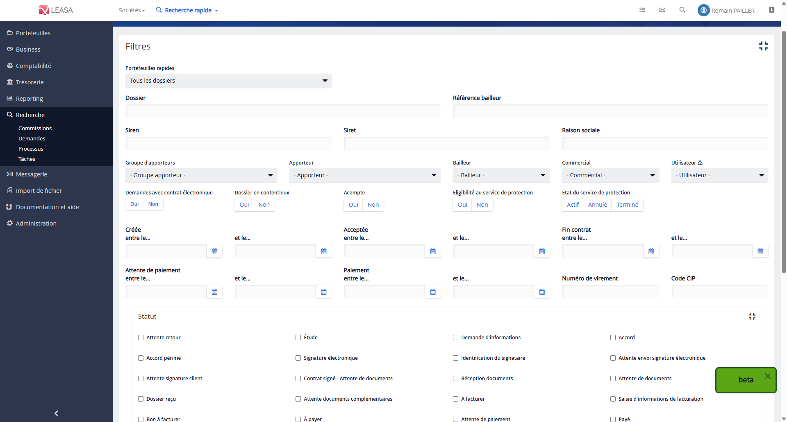

# Migration de l'écran de recherche de demandes

## Contexte

L’écran de recherche de demandes est un **outil central pour les utilisateurs** de l’application Leasa, en particulier les équipes **ADV back-office** et **commerciaux**. Il leur permet d’effectuer des **recherches précises de dossiers**, mais également de générer des **exports Excel** à des fins de reporting.

Cependant, cette page présente aujourd’hui plusieurs **limites importantes** :

- Elle contient un **nombre important de filtres**, parfois redondants ou peu lisibles.
- Son **ergonomie** est perfectible, rendant la navigation peu intuitive.
- Elle est toujours **développée en AngularJS**, ce qui freine les évolutions techniques et son intégration avec les nouveaux composants du projet.

👉 Une **migration vers Angular 2+** est donc indispensable pour répondre aux besoins actuels tout en assurant la maintenabilité future. Cette refonte s’inscrit dans le chantier global de **modernisation de l’interface Leasa**.

## Étapes

### 1. Recueil des besoins

Avant d'ajouter de nouvelles fonctionnalités, il est essentiel de comprendre précisément les attentes fonctionnelles. Cette étape consiste à échanger avec les utilisateurs finaux du projet (dans ce cas : les commerciaux back-office) afin de définir clairement :

- Les fonctionnalités existantes à conserver.
- Les évolutions ou améliorations souhaitées sur l'écran concerné.

En amont de ces échanges, j'ai préparé les questions à poser aux utilisateurs en collaboration avec Nicolas, graphiste du projet. Cet échange a permis de structurer un cadre précis pour les réunions, afin d'éviter de dériver vers des besoins extérieurs au périmètre fonctionnel de l'écran à améliorer.

Pour réaliser le recueil des besoins, j'ai été accompagné par Charlotte, analyste fonctionnelle du projet, et Nicolas. Ensemble, nous avons organisé deux réunions regroupant cinq utilisateurs. L'objectif était de comprendre leurs habitudes d'utilisation actuelles et d'identifier leurs nouveaux besoins de manière ciblée.

À l'issue de ces réunions, j'ai rédigé un compte rendu détaillé synthétisant les retours recueillis.

### 2. Élaboration de wireframes

Une fois les besoins formalisés, des **wireframes**[^wireframe] sont créés. Ces schémas simples permettent de visualiser la structure de la future interface sans se concentrer sur le style graphique :

- Disposition des éléments (champs de recherche, filtres, résultats, boutons d'action).
- Parcours utilisateur logique et ergonomique.
- Mise en avant des fonctionnalités principales.

### 3. Réalisation de maquettes graphiques

Les wireframes validés sont traduits en **maquettes**[^maquette] plus détaillées :

- Application de la charte graphique de l'entreprise.
- Définition des couleurs, typographies, icônes, et styles des composants.
- Validation du rendu visuel final auprès des équipes métiers et techniques.

### 4. Présentation des maquettes au siège (Paris)

Les maquettes réalisées sont présentées aux équipes métier et aux décideurs basés au siège (Paris) :

- Recueil des retours utilisateurs sur l'ergonomie et le design.
- Ajustements éventuels suite aux observations ou nouvelles attentes.
- Validation formelle de la future interface avant phase de spécifications.

### 5. Rédaction des spécifications fonctionnelles

Une fois la maquette validée, un document de **spécifications fonctionnelles**[^specs] est rédigé. Il décrit de manière exhaustive :

- Le comportement attendu de chaque élément de l'interface.
- Les règles de gestion métier associées.
- Les interactions prévues entre les différents composants.
Ce document sert de référence commune pour les développeurs et les testeurs.

### 6. Ateliers techniques avec les développeurs

Enfin, des **ateliers techniques**[^ateliers] sont organisés avec l'équipe de développement pour :

- Étudier la faisabilité technique des éléments décrits.
- Identifier les composants Angular existants pouvant être réutilisés.
- Définir l'architecture technique adaptée (services, modèles, modules Angular).
- Anticiper les éventuels défis techniques liés à la migration (ex. compatibilité avec l'API existante, gestion des formulaires complexes).

Ce travail collaboratif garantit une migration fluide, respectueuse des attentes fonctionnelles tout en assurant la qualité du code livré.

## Présentation du rest

expliquer comment ça marche techniquement auj et dire ce que je vais modifier

## Présentation Client

angularJS et angular 2+ prés du double routing, migration et création de composants de recherche

## Présentation de ML-UI

Expliquer à quoi ça sert + ce que j'ai fait
