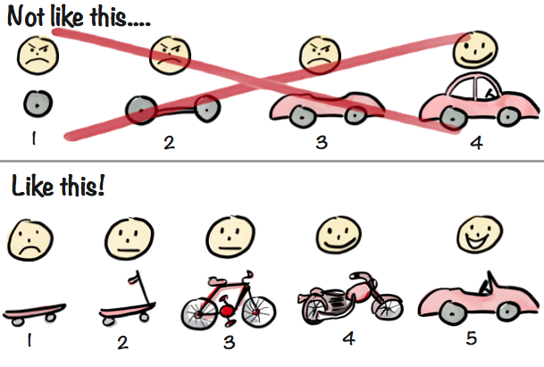

# Premier ticket – Affichage des résultats

## Objectif

Avant d’entrer dans les développements complexes liés aux nombreux filtres de recherche, il fallait d’abord construire une base fonctionnelle **simple, stable et fiable**.  
Mon tuteur m’a alors présenté une analogie claire : **“Avant de construire une voiture qui va très vite, construisons un skateboard.”**  
Autrement dit, nous devions d’abord réaliser une version minimale mais fonctionnelle de la recherche, capable d’afficher **une liste de résultats** en réponse à un clic sur un bouton.

L’objectif était donc de **valider la structure technique**, aussi bien côté client que serveur, en affichant simplement **toutes les demandes** disponibles, sans filtre.

## Ce que j’ai développé

J’ai conçu ce ticket comme une **base fondatrice** pour tous les développements suivants. Il m’a permis de :

- Mettre en place le lien entre le front Angular et l’API REST.
- Afficher la liste des demandes dans un tableau.
- Gérer un premier bouton d’action (“Rechercher”) qui appelle le serveur.

Ce premier affichage de résultats correspond donc au **“skateboard”** du projet : ce n’est pas encore une application complète, mais c’est déjà un produit **cohérent, démontrable et utile**.

## Ticket

## Points techniques

### Explication côté serveur

[Consulter la documentation du développement côté serveur](./Cote-serveur.md)

- Implémentation d’un endpoint REST pour récupérer toutes les demandes.
- Mapping des entités vers des DTO pour exposer uniquement les données nécessaires au front.

### Explication côté client

[Consulter la documentation du développement côté client](./Cote-client.md)

- Appel du service REST via Angular `HttpClient`.
- Traitement des réponses côté service.
- Affichage dynamique dans un tableau responsive.

## Temps investi

Ce premier développement m’a demandé **beaucoup de temps**, car il s’agissait de **poser des fondations solides** :  
plutôt que d’ajouter des fonctionnalités rapidement, j’ai pris le temps de bien comprendre l’ensemble de la chaîne de traitement, de la base de données à l’affichage final.

## Résultat

À l’issue de ce ticket, j’avais en main une **structure de recherche fonctionnelle**, capable de :

- Interroger le serveur de manière fiable,
- Afficher les résultats dans l’interface,
- Être enrichie progressivement avec de nouveaux filtres sans tout reconstruire.

C’est à partir de cette base que j’ai ensuite développé tous les autres tickets du module de recherche de demandes.

---

