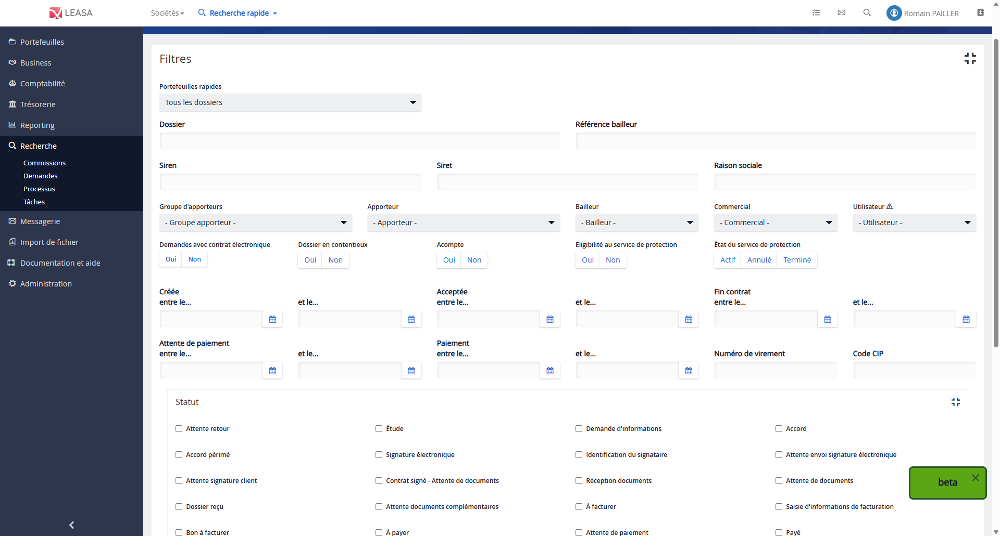

# Migration de l'écran de recherche de demandes

## Contexte

L’écran de recherche de demandes est un **outil central pour les utilisateurs** de l’application Leasa, en particulier les équipes **ADV back-office** et **commerciaux**. Il leur permet d’effectuer des **recherches précises de dossiers**, mais également de générer des **exports Excel** à des fins de reporting.

Cependant, cette page présente aujourd’hui plusieurs **limites importantes** :

- Une **quantité importante de filtres**, parfois redondants ou peu compréhensibles.
- Une **ergonomie datée**, qui rend la navigation peu intuitive.
- Un développement basé sur **AngularJS**, qui freine son intégration avec les nouveaux composants Angular du projet.

C’est dans ce cadre que **mon projet principal** a été défini : **migrer cet écran stratégique vers Angular 2+**, en respectant son fonctionnement actuel mais en repensant son ergonomie.

## Étapes

### 1. Analyse de l'existant

Avant de pouvoir entamer les développements, j’ai commencé par une [**phase d’analyse de l’existant**](../../annexes/Recherche-de-demandes/analyse_existant_recherche_demande.md), aussi bien côté **front-end que back-end**. Cette étape m’a permis de comprendre en profondeur :

- Le fonctionnement du code AngularJS actuel.
- Les différentes couches métier liées à la recherche.
- Le parcours utilisateur et les cas d’usages fonctionnels.

J’ai également étudié la manière dont les données étaient transmises et affichées dans l’interface, ainsi que les interactions avec les services backend.

### 2. Recueil des besoins

Une fois cette première compréhension technique en place, j’ai participé au [**recueil des besoins utilisateurs**](../../annexes/Recherche-de-demandes/cr_recueil_besoins_recherche_demande.md) afin d’identifier :

- Les fonctionnalités essentielles à conserver.
- Les améliorations attendues par les utilisateurs.

Pour préparer ces réunions, j’ai travaillé en amont avec **Nicolas** (graphiste UI/UX) pour structurer les questions à poser. Ce travail préparatoire a permis d’éviter de dériver hors périmètre fonctionnel pendant les réunions.

J’ai ensuite animé deux réunions avec **Charlotte** (analyste fonctionnelle) et Nicolas, réunissant cinq utilisateurs finaux. Ces échanges ont permis de comprendre leurs usages actuels, leurs doléances, et leurs attentes concrètes pour la nouvelle version de l’écran.

### 3. Élaboration de wireframes

Une fois les besoins bien cadrés, j’ai pris l’initiative de **[réaliser les wireframes](../../annexes/Recherche-de-demandes/Maquette.md#wireframes-drawio)** de la future interface. Ces schémas simples ont permis de valider :

- L’emplacement des filtres et des résultats.
- Le parcours utilisateur logique.
- La mise en avant des fonctionnalités essentielles.

### 4. Réalisation de maquettes

Avec l’appui de Nicolas, les wireframes ont ensuite été transformés en **[maquettes complètes](../../annexes/Recherche-de-demandes/Maquette.md#maquettes)**, intégrant :

- La charte graphique Leasa.
- Les icônes, couleurs et composants normalisés.
- Un rendu fidèle à l’application cible.

### 5. Présentation des maquettes au siège (Paris)

Nous avons ensuite présenté les maquettes aux **équipes métiers basées au siège** (Paris). Ce rendez-vous a permis de :

- Recueillir les derniers retours utilisateurs.
- Apporter quelques ajustements visuels et fonctionnels.
- Valider formellement la future interface avant rédaction des tickets de spécifications.

### 6. Rédaction des spécifications fonctionnelles

Sur la base des maquettes validées, j’ai participé à la rédaction des **spécifications fonctionnelles**, en collaboration avec l’équipe fonctionnelle (Charlotte et Benoît).  
Ce document détaille précisément :

- Le rôle de chaque filtre.
- Les règles de gestion métier.
- Les comportements attendus côté front-end et backend.

Il a ensuite servi de support de référence pour le développement et les phases de tests.

### 7. Listes des fonctionnalités développées

Après toutes ces étapes réalisées, j'ai pu enfin commencé à développer. Voici une liste chronologique de mes développements :

- [L'affichage des résultats](./Affichage_des_resultats/) : Premier développement de la nouvelle page avec une fonctionnalité simpliste, un bouton pour rechercher toutes les demandes. Il m'a permis de mieux comprendre l'ensemble du code tant côté client que côté serveur.
- [Ajout d'un filtre par numéro de dossier](./Ajout_du_premier_critere_recherche/Cote-client.md)
- [Bouton Réinitialiser](./Ajout_bouton_reinit/Cote-client.md)
- [Ajout d'un filtre par référence bailleur](./Ajout_du_deuxieme_critere_recherche/index.md)
- [Ajout d'un filtre par Loueurs](./Ajout_du_troisieme_critere_recherche/index.md)
- [Ajout nombre de résultats et calculs des montants totaux achat et vente](./Ajout_nb_resultats_calcul_montants_ht/Cote-client.md)
- [Ajout d'un filtre par groupe de partenaires](./Ajout_filtre_groupe_partenaires/cote_client.md)
