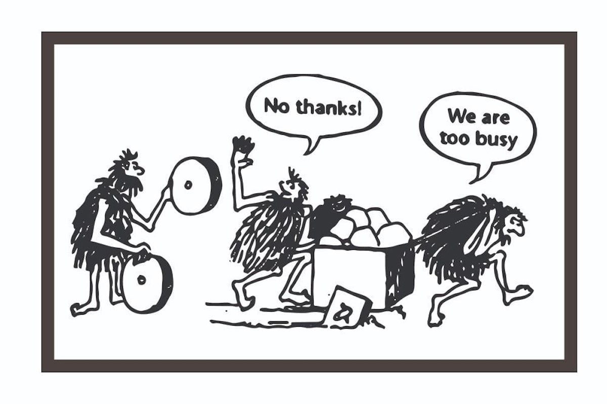

# Présentation des Missions

Dans le cadre de mon alternance au sein de Nanceo, j'ai été recruté principalement pour réaliser un travail de **migration technique** d'écrans existants. Mon objectif était clair : contribuer activement à la modernisation de l’application back-office en migrant progressivement des composants développés sous **AngularJS** vers **Angular** (versions 2 et ultérieures).

Pour mieux présenter ce travail, j’ai choisi de l’organiser en trois grandes catégories : 

- **Les nouvelles fonctionnalités**
- **Les corrections**
- **L'analyse fonctionnelle**

---

## Migration d'AngularJS vers Angular (2+) : enjeux et importance

### AngularJS : une technologie obsolète

Quand j’ai commencé, une grande partie de l’application reposait sur **AngularJS**[^1], un des premiers *frameworks*[^2] front-end très populaires pour créer des applications web dynamiques (**SPA**[^3]).  
Sorti en 2010, il a été massivement adopté, mais Google a mis fin à son support officiel fin 2021, ce qui signifie qu’il n’existe plus aucune mise à jour ni correctif de sécurité depuis janvier 2022.

De son côté, **Angular**[^4] (souvent appelé Angular 2+ pour les versions ultérieures) est une refonte complète, sortie dès 2016.  
Il repose sur une architecture par **composants**[^5], utilise **TypeScript**[^6] et apporte des améliorations majeures en matière de performance, de maintenabilité et de fonctionnalités. Contrairement à AngularJS, il est encore activement maintenu, avec de nouvelles versions stables publiées environ tous les six mois.

#### Tableau comparatif – AngularJS vs Angular (2+)

| Critère                | AngularJS (1.x)                                | Angular (2+)                                       |
|------------------------|-----------------------------------------------|---------------------------------------------------|
| **Année de sortie**    | 2010                                           | 2016                                              |
| **Langage principal**  | JavaScript                                     | TypeScript                                        |
| **Architecture**       | MVC (*Model-View-Controller*)                  | Basée sur des composants                         |
| **Performances**       | Plus lentes, cycle digest fréquent             | Plus rapides, compilation AOT (*Ahead-of-Time*)  |
| **Maintenance**        | Fin du support depuis janvier 2022             | Mises à jour régulières (2/an)                   |
| **Communauté**         | En forte diminution                            | Active et en croissance                          |                                              |
| **Gestion des modules**| Limitée                                        | Complète (architecture modulaire)                |
| **Outils CLI**         | Non                                            | Oui (CLI Angular officiel)                       |
| **Sécurité**           | Plus de correctifs, failles non comblées       | Correctifs réguliers                              |

### Dette technique et risques liés à AngularJS

Continuer à utiliser AngularJS aujourd’hui revient à accumuler de la **dette technique**[^7] : un coût futur lié au maintien de solutions obsolètes. Plus on tarde à migrer, plus cette dette pèse lourd.

Les principaux risques sont clairs:

- **Sécurité** : plus aucun correctif pour combler les failles critiques.  
- **Maintenance** : rareté des développeurs AngularJS et absence de correction des bugs connus.  
- **Compatibilité** : difficultés croissantes avec les technologies web récentes.

### Conclusion

La migration d’AngularJS vers Angular 2+ n’était pas seulement une amélioration technique : c’était une **nécessité stratégique** pour garantir la sécurité, la pérennité et la performance de l’application.  
Pendant mon alternance, j’ai joué un rôle clé dans ce processus, en prenant en compte à la fois les contraintes **techniques** et les besoins **métier** du projet.

---

[^1]: **AngularJS** : Framework JavaScript front-end lancé par Google en 2010 (versions 1.x), basé sur le modèle MVC.
[^2]: **Framework** : Cadre applicatif offrant des outils, composants et conventions pour faciliter le développement logiciel.
[^3]: **SPA (Single Page Application)** : Application web monopage ne nécessitant pas de rechargements complets, pour une navigation fluide.
[^4]: **Angular (2+)** : Refondation complète d'AngularJS publiée en 2016, avec une architecture basée sur TypeScript et les composants.
[^5]: **Composant (Component)** : Élément indépendant regroupant logique, vue et style d'une partie d'une application Angular.
[^6]: **TypeScript** : Surcouche de JavaScript développée par Microsoft, apportant le typage statique et des outils de développement robustes.
[^7]: **Dette technique** : Coût futur induit par l'usage de solutions techniques obsolètes ou sous-optimales.
[^8]: **Architecture modulaire** : Organisation du code en modules ou composants autonomes facilitant la maintenance et l’évolution.
[^9]: **PWA (Progressive Web App)** : Application web enrichie pour offrir une expérience proche d'une application mobile native (installation, hors-ligne, notifications).
[^10]: **CLI Angular (Command Line Interface)** : Outil en ligne de commande qui permet de créer, développer, tester et déployer facilement des applications Angular grâce à des commandes simples.
