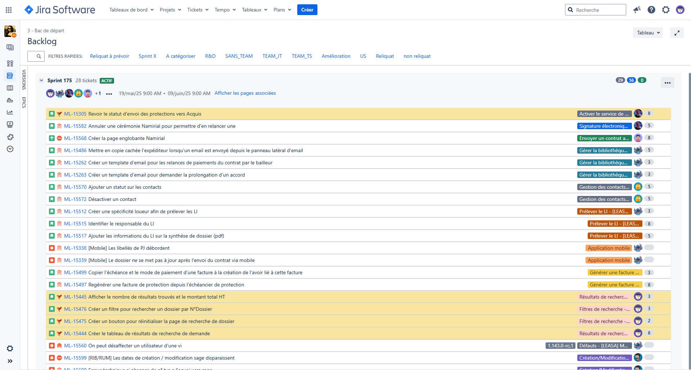
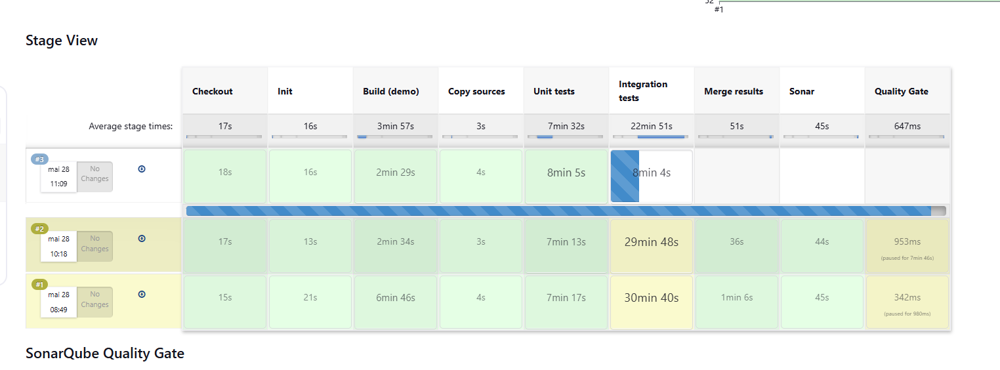
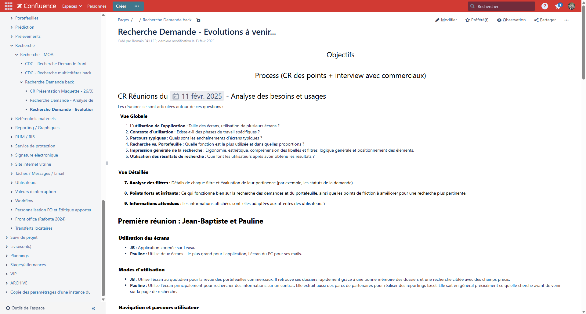

# Méthodologie Agile

Dans mon équipe, le développement de l’application Leasa suit la **méthodologie Agile**, avec des **sprints** d’une durée de trois semaines.

## Organisation des sprints

Chaque sprint commence par deux moments clés :

- Une **rétrospective**, durant laquelle l'équipe revient sur le déroulement du sprint précédent. L’objectif est d’identifier les points positifs, les éventuels blocages rencontrés et de proposer des axes d’amélioration.
- Une **revue de sprint**, qui permet de présenter à l’ensemble de l’équipe (et aussi au responsable du back office  Christophe PEREIRA) les livrables produits durant les trois semaines écoulées.

L’ensemble du travail à réaliser est planifié dans un **tableau de sprint** accessible via l’outil **Jira**. Chaque ticket correspond à une tâche de développement, un correctif ou une amélioration, et est rattaché à une version précise de l’application.

## Gestion du code source

Le développement suit un processus de [versioning](../glossaire/Vocab.md#versioning) rigoureux :

- Chaque développeur effectue un **[fork](../glossaire/Vocab.md#fork)** du projet principal.
- Les modifications sont soumises sous forme de **[pull request](../glossaire/Vocab.md#pull-request)**.
- Chaque pull request est automatiquement **validée par Jenkins**, via une suite de **tests automatisés** (unitaires, d’intégration...).
- Un ou plusieurs collègues sont ensuite chargés de **relire et valider la PR** avant intégration.

Ce processus garantit la **qualité du code** et la **stabilité** des fonctionnalités livrées.

## Documentation fonctionnelle

L’outil **Confluence** est notre référentiel principal pour toute la documentation liée au projet.  
Il est structuré autour de plusieurs usages clés :

- **Documentation fonctionnelle** : rédaction et mise à jour des **cahiers des charges** et des spécifications fonctionnelles. Ces documents détaillent le périmètre, les règles de gestion et les objectifs des évolutions à développer.  
- **[Changelog](../glossaire/Vocab.md#changelog)** des nouvelles versions : description des fonctionnalités, correctifs et évolutions livrées.
- **Documentation technique** : tutoriels internes pour installer les outils de développement, guides de démarrage, procédures de déploiement...
- **Notes de version** : synthèses des sprints et préparation des futures mises en production.

Confluence joue ainsi un rôle central dans la **structuration des échanges** entre les équipes métier et technique.  
Il permet de garantir que chaque évolution est bien cadrée dès sa conception et que toutes les parties prenantes disposent d’une **vision claire et partagée** du projet.

---

Cette organisation agile favorise une **collaboration fluide** au sein de l’équipe, et une **livraison continue** de valeur au fil des versions. Elle m’a permis de travailler dans un cadre structuré, tout en développant des réflexes essentiels dans la gestion de projet logiciel en entreprise.

---